# Laboratório Azure - Aluguel de Bicicletas

## Passo-a-passo

- [Criando o primeiro laboratório](#criando-o-primeiro-laboratorio)
  - [Machine Learning](#machine-learning)
    - [Workspace](#workspace)
- [Azure Machine Learning Studio](#azure-machine-learning-studio)
  - [ML Automatizado](#ml-automatizado)
  - [Metrics](#metrics)

## Criando o primeiro laboratório

Para criar seu laboratório, é necessário ter uma conta no Azure e buscar em *Create a resources* o nome "Azure Machine Learning".
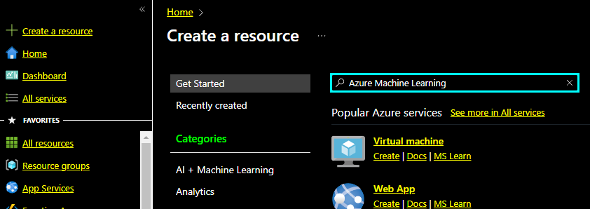

### Machine Learning

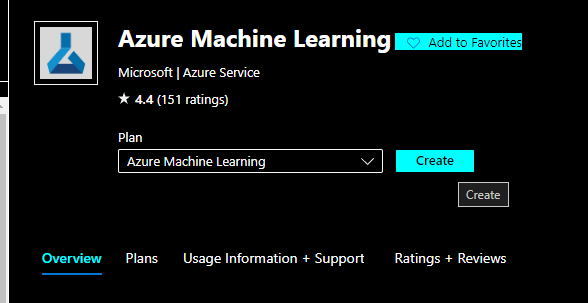
Após clicar em *Create* no "Azure Machine Learning", você será levado a uma página onde poderá criar seu *Resource Group*.

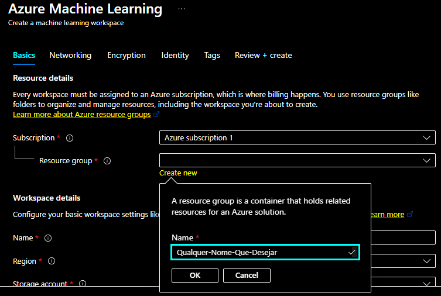

O *Resource Group* é onde será armazenado seus projetos de laboratório. Crie um com o nome que desejar ou, caso já tenha criado antes, é possível selecionar um grupo existente.

#### Workspace

Nessa parte é onde criamos nosso laboratório, escolhendo um nome exclusivo para ele e uma região onde será hospedado.

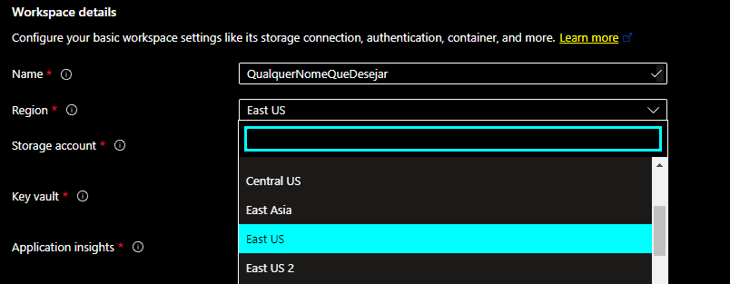

Nessa parte também é gerado uma conta de armazenamento, uma chave e um application insights.

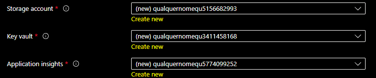

Também podemos escolher o acesso ao nosso laboratóio:

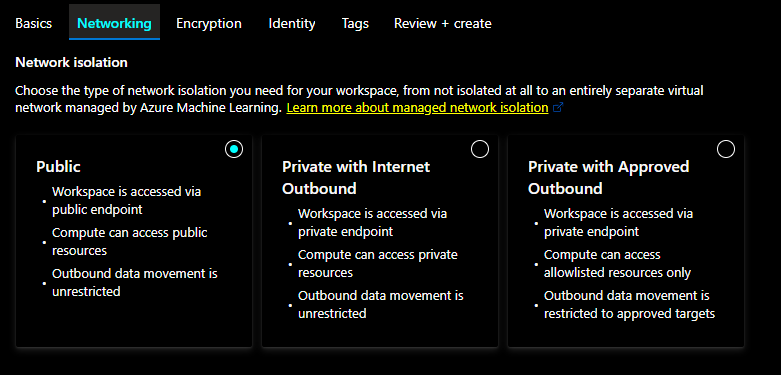

A forma de encriptação:

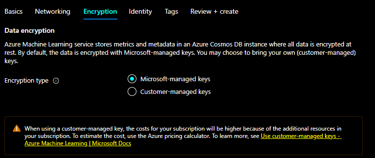

Permissionamento:

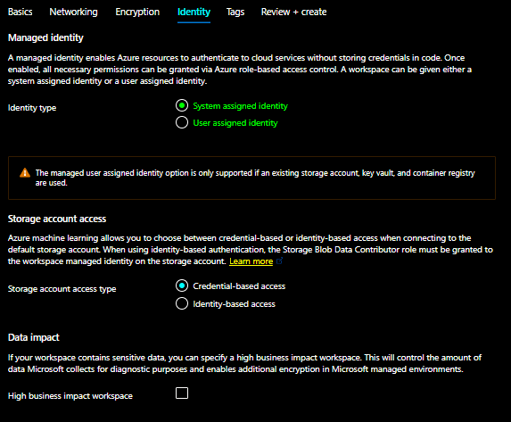

E os rótulos para recursos:

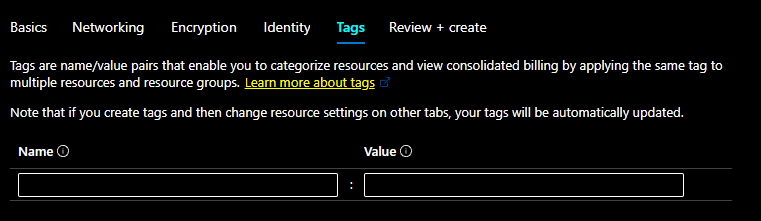

Após terminado, pode criar.

## Azure Machine Learning Studio

É aqui onde poderemos trabalhar com nosso laboratório, mas para isso precisamos acessa-lo.
Após finalizar o processo de criação do laboratório, você será redirecionado a uma página onde deverá aguardar até que ele seja criado. Assim que terminar, podemos ir para "Go to resource".

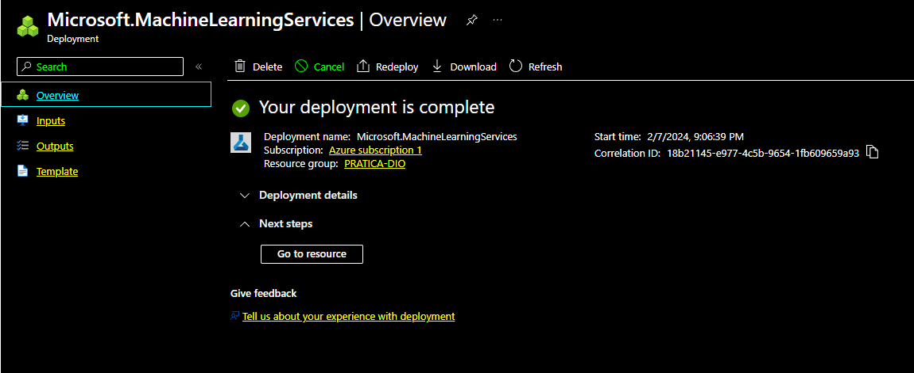

E adentrar no Azure Machine Learning Studio.

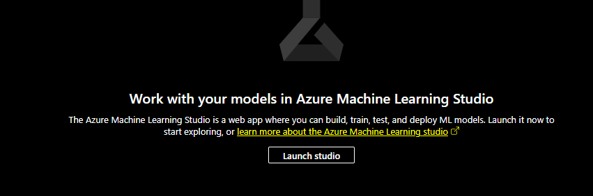

Azure Machine Learning Studio:

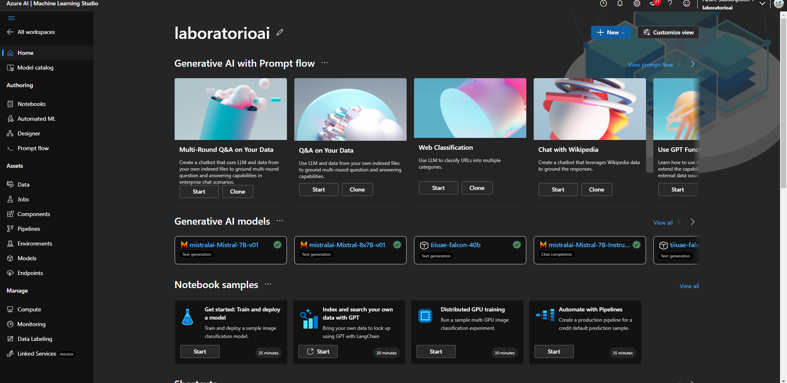

### ML Automatizado

Agora que estamos no estúdio, vamos em "Automated ML" e depois em "New Automated ML job".

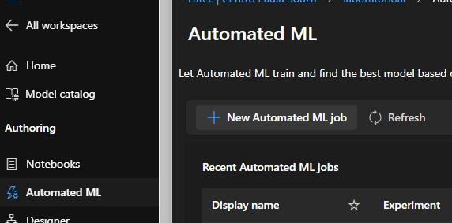

Agora, podemos seguir o exemplo criado pela microsoft de um aluguel de bicicletas

- [Explore Automated Machine Learning in Azure Machine Learning](https://microsoftlearning.github.io/mslearn-ai-fundamentals/Instructions/Labs/01-machine-learning.html)

Após a finalização do processo, é necessário aguardar até que ele seja completo.

### Metrics

Com a finalização concluida, vamos em *Algorithm name*.

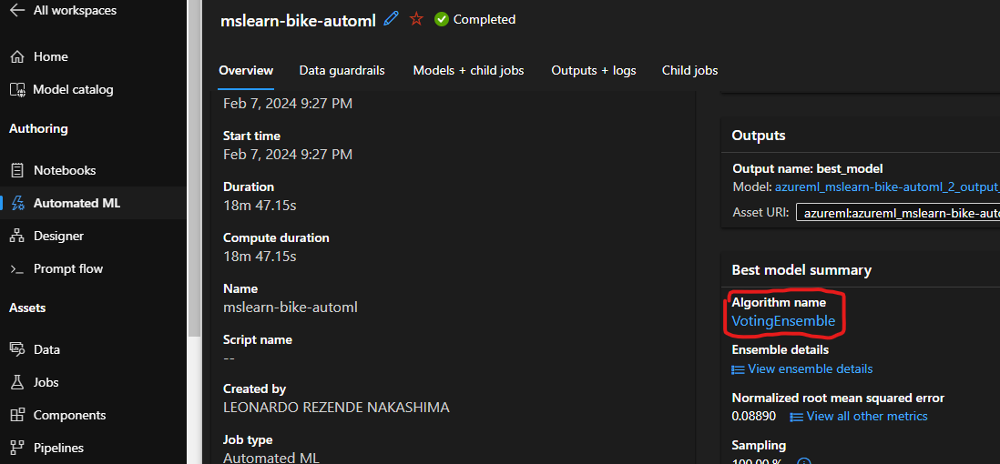

E depois selecionamos a aba Metrics.

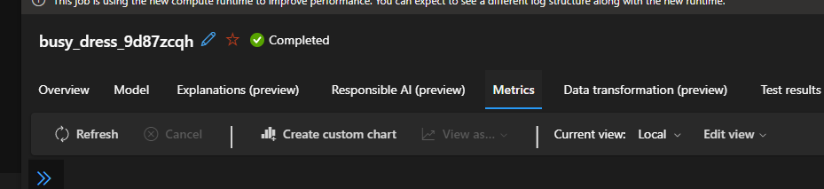

Com isso, temos as informações que desejamos sobre o aluguel de bicicletas, apesar das mais importantes serem o **True Value** e **Residuals**

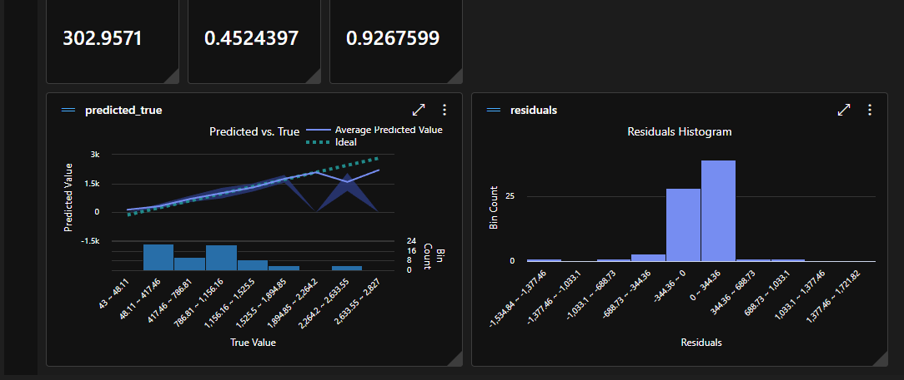
